# Yazılım Geliştirme Laboratuvarı - II | Proje 1

| | |
|---|---|
| **Ders** | Yazılım Geliştirme Laboratuvarı - II |
| **Öğrenciler** | Mehmet Biçer - 241307111 |
| | Ebubekir Yılmaz - 231307044 |
| **Tarih** | 05.04.2026 |

---

## İçindekiler

1. [Giriş](#1-giriş)
2. [Sistem Mimarisi](#2-sistem-mimarisi)
3. [Richardson Olgunluk Modeli](#3-richardson-olgunluk-modeli)
4. [Servisler ve Sınıf Yapıları](#4-servisler-ve-sınıf-yapıları)
5. [Sequence Diyagramları](#5-sequence-diyagramları)
6. [TDD Yaklaşımı](#6-tdd-yaklaşımı)
7. [Docker ve Sistem Orkestrasyonu](#7-docker-ve-sistem-orkestrasyonu)
8. [Görselleştirme](#8-görselleştirme)
9. [Yük Testi](#9-yük-testi)
10. [Ekran Görüntüleri](#10-ekran-görüntüleri)
11. [Sonuç ve Tartışma](#11-sonuç-ve-tartışma)

---

## 1. Giriş

Bu proje, modern yazılım geliştirme süreçlerinin temelini oluşturan **Mikroservis Mimarisi** ve servisler arası trafik yönetimini sağlayan bir **Dispatcher (API Gateway)** yazılımının uçtan uca geliştirilmesini kapsamaktadır.

Sistem; bir e-ticaret senaryosu üzerine kurgulanmıştır. Yoğun trafik altında çalışabilecek, birbirinden bağımsız mikroservisler tasarlanmış ve tüm dış erişim merkezi bir Dispatcher üzerinden yönetilmiştir.

**Temel Hedefler:**
- Tüm dış isteklerin tek giriş noktası (Dispatcher) üzerinden yönlendirilmesi
- JWT tabanlı merkezi yetkilendirme
- Servis izolasyonu ve bağımsız veri tabanları
- TDD disipliniyle Dispatcher geliştirilmesi
- Gerçek zamanlı izleme (Prometheus + Grafana)
- Yük testi ile performans ölçümü (k6)

---

## 2. Sistem Mimarisi

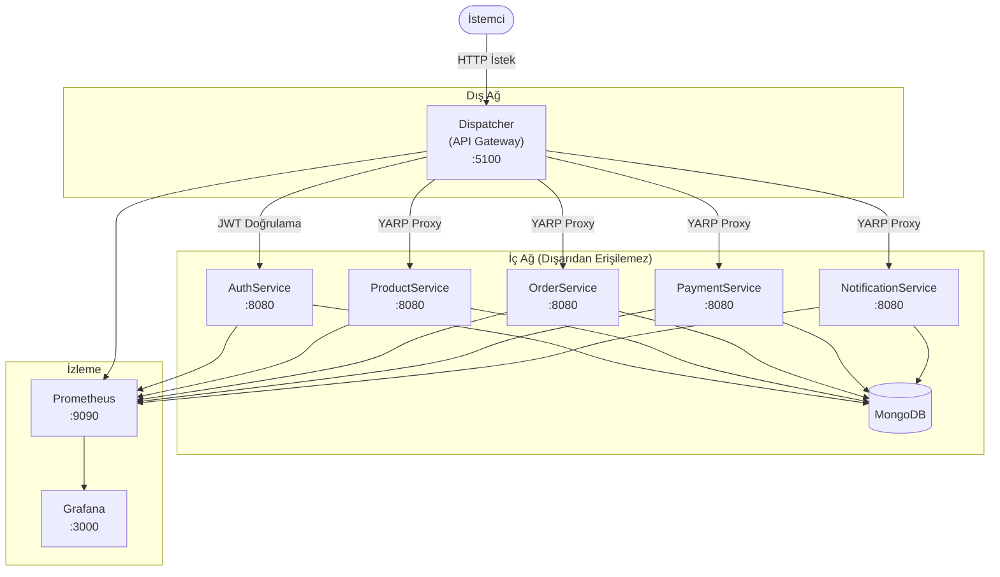
```mermaid
graph TB
    Client([İstemci])

    subgraph External["Dış Ağ"]
        Dispatcher["Dispatcher\n(API Gateway)\n:5100"]
    end

    subgraph Internal["İç Ağ (Dışarıdan Erişilemez)"]
        Auth["AuthService\n:8080"]
        Product["ProductService\n:8080"]
        Order["OrderService\n:8080"]
        Payment["PaymentService\n:8080"]
        Notification["NotificationService\n:8080"]
        MongoDB[(MongoDB)]
    end

    subgraph Monitoring["İzleme"]
        Prometheus["Prometheus\n:9090"]
        Grafana["Grafana\n:3000"]
    end

    Client -->|"HTTP İstek"| Dispatcher
    Dispatcher -->|"JWT Doğrulama"| Auth
    Dispatcher -->|"YARP Proxy"| Product
    Dispatcher -->|"YARP Proxy"| Order
    Dispatcher -->|"YARP Proxy"| Payment
    Dispatcher -->|"YARP Proxy"| Notification

    Auth --> MongoDB
    Product --> MongoDB
    Order --> MongoDB
    Payment --> MongoDB
    Notification --> MongoDB

    Dispatcher --> Prometheus
    Auth --> Prometheus
    Product --> Prometheus
    Order --> Prometheus
    Payment --> Prometheus
    Notification --> Prometheus
    Prometheus --> Grafana
```

### Network Isolation

Sistemde iki ayrı Docker ağı kullanılmaktadır:

- **`external`**: Sadece Dispatcher, Prometheus ve Grafana bu ağa bağlıdır. Dış dünyadan erişilebilir.
- **`internal`**: Tüm mikroservisler bu ağdadır. Dışarıdan doğrudan erişim **mümkün değildir**.

Bu sayede mikroservislere doğrudan erişim engellenmiş, tüm trafik Dispatcher üzerinden geçmeye zorlanmıştır.

---

## 3. Richardson Olgunluk Modeli

Tüm API'ler **RMM Seviye 2** standartlarında geliştirilmiştir.

| Seviye | Açıklama | Uygulama |
|--------|----------|----------|
| **0** | Tek URI | ✅ |
| **1** | Kaynak bazlı URI | ✅ `/api/products`, `/api/orders` |
| **2** | HTTP Metotları + Durum Kodları | ✅ GET/POST/PUT/DELETE, 200/201/401/404/409 |

### HTTP Metot Kullanımı

| İşlem | Metot | Endpoint | Durum Kodu |
|-------|-------|----------|------------|
| Listeleme | `GET` | `/api/products` | 200 |
| Tekil getir | `GET` | `/api/products/{id}` | 200 / 404 |
| Oluştur | `POST` | `/api/products` | 201 |
| Güncelle | `PUT` | `/api/products/{id}` | 200 / 404 |
| Sil | `DELETE` | `/api/products/{id}` | 200 / 404 |
| Login | `POST` | `/auth/login` | 200 / 401 |
| Kayıt | `POST` | `/auth/register` | 200 / 409 |

---

## 4. Servisler ve Sınıf Yapıları

Sistem aşağıdaki 6 bağımsız birimden oluşmaktadır:

### 4.1 Dispatcher (API Gateway)

Her servis **Domain → Application → Infrastructure → Api** katmanlı mimarisiyle geliştirilmiştir.

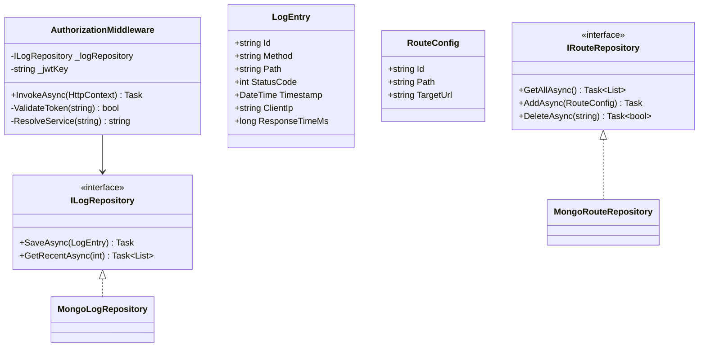
```mermaid
classDiagram
    class AuthorizationMiddleware {
        -ILogRepository _logRepository
        -string _jwtKey
        +InvokeAsync(HttpContext) Task
        -ValidateToken(string) bool
        -ResolveService(string) string
    }

    class LogEntry {
        +string Id
        +string Method
        +string Path
        +int StatusCode
        +DateTime Timestamp
        +string ClientIp
        +long ResponseTimeMs
    }

    class RouteConfig {
        +string Id
        +string Path
        +string TargetUrl
    }

    class ILogRepository {
        <<interface>>
        +SaveAsync(LogEntry) Task
        +GetRecentAsync(int) Task~List~
    }

    class IRouteRepository {
        <<interface>>
        +GetAllAsync() Task~List~
        +AddAsync(RouteConfig) Task
        +DeleteAsync(string) Task~bool~
    }

    AuthorizationMiddleware --> ILogRepository
    ILogRepository <|.. MongoLogRepository
    IRouteRepository <|.. MongoRouteRepository
```

### 4.2 AuthService

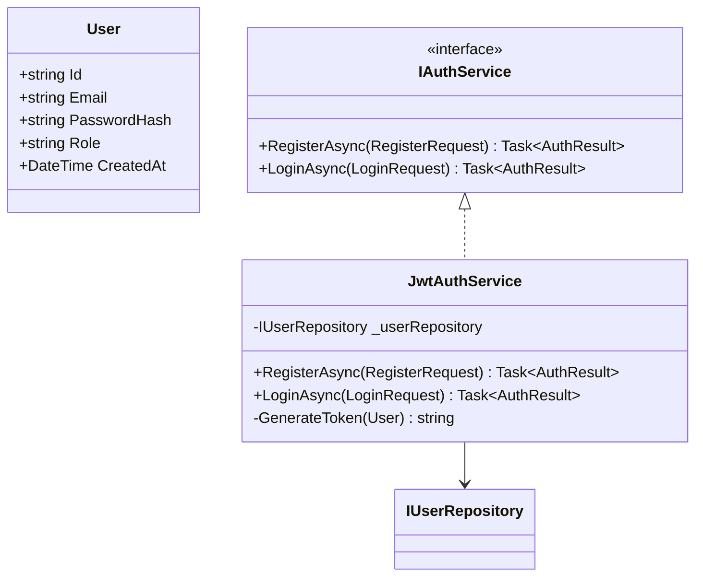
```mermaid
classDiagram
    class User {
        +string Id
        +string Email
        +string PasswordHash
        +string Role
        +DateTime CreatedAt
    }

    class IAuthService {
        <<interface>>
        +RegisterAsync(RegisterRequest) Task~AuthResult~
        +LoginAsync(LoginRequest) Task~AuthResult~
    }

    class JwtAuthService {
        -IUserRepository _userRepository
        +RegisterAsync(RegisterRequest) Task~AuthResult~
        +LoginAsync(LoginRequest) Task~AuthResult~
        -GenerateToken(User) string
    }

    IAuthService <|.. JwtAuthService
    JwtAuthService --> IUserRepository
```

### 4.3 ProductService

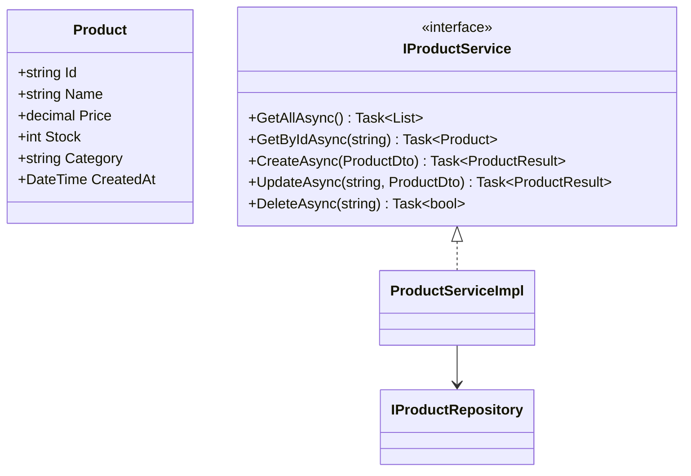
```mermaid
classDiagram
    class Product {
        +string Id
        +string Name
        +decimal Price
        +int Stock
        +string Category
        +DateTime CreatedAt
    }

    class IProductService {
        <<interface>>
        +GetAllAsync() Task~List~
        +GetByIdAsync(string) Task~Product~
        +CreateAsync(ProductDto) Task~ProductResult~
        +UpdateAsync(string, ProductDto) Task~ProductResult~
        +DeleteAsync(string) Task~bool~
    }

    IProductService <|.. ProductServiceImpl
    ProductServiceImpl --> IProductRepository
```

### 4.4 OrderService

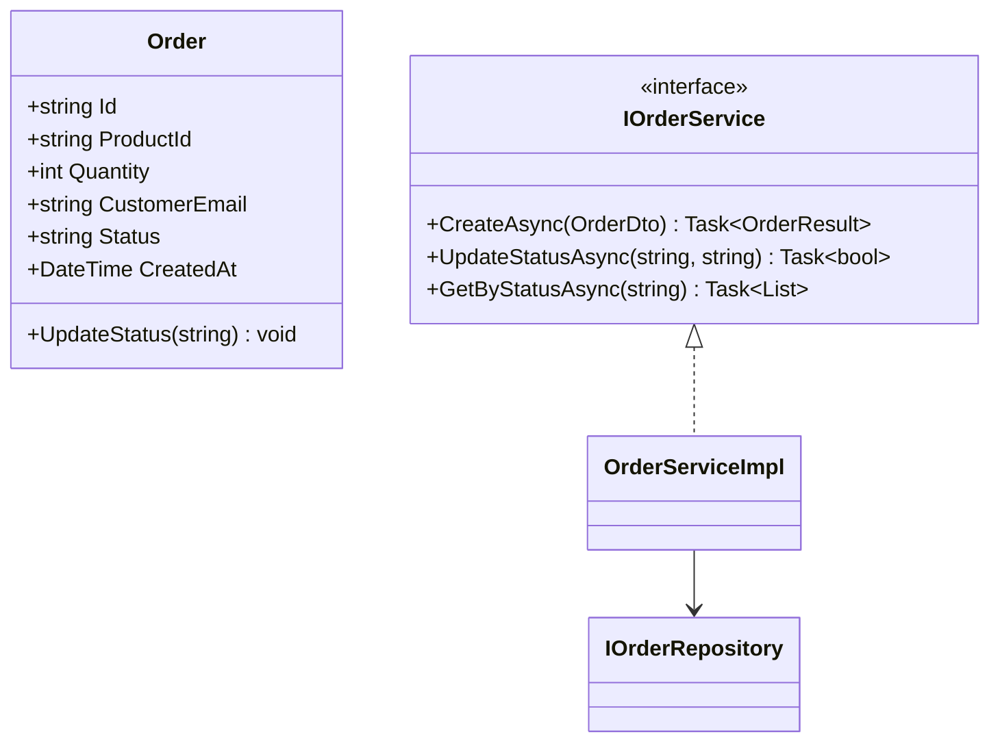
```mermaid
classDiagram
    class Order {
        +string Id
        +string ProductId
        +int Quantity
        +string CustomerEmail
        +string Status
        +DateTime CreatedAt
        +UpdateStatus(string) void
    }

    class IOrderService {
        <<interface>>
        +CreateAsync(OrderDto) Task~OrderResult~
        +UpdateStatusAsync(string, string) Task~bool~
        +GetByStatusAsync(string) Task~List~
    }

    IOrderService <|.. OrderServiceImpl
    OrderServiceImpl --> IOrderRepository
```

### 4.5 PaymentService

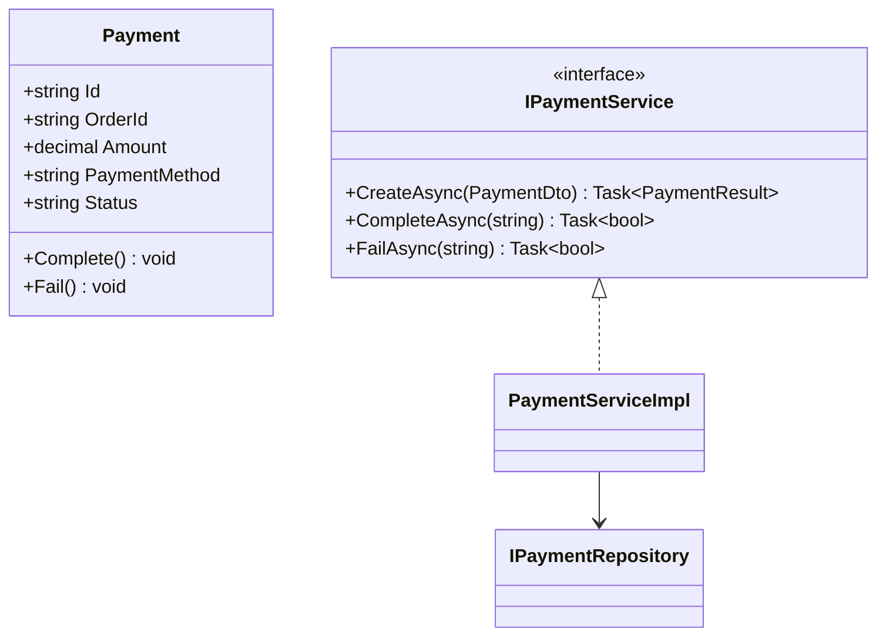
```mermaid
classDiagram
    class Payment {
        +string Id
        +string OrderId
        +decimal Amount
        +string PaymentMethod
        +string Status
        +Complete() void
        +Fail() void
    }

    class IPaymentService {
        <<interface>>
        +CreateAsync(PaymentDto) Task~PaymentResult~
        +CompleteAsync(string) Task~bool~
        +FailAsync(string) Task~bool~
    }

    IPaymentService <|.. PaymentServiceImpl
    PaymentServiceImpl --> IPaymentRepository
```

### 4.6 NotificationService

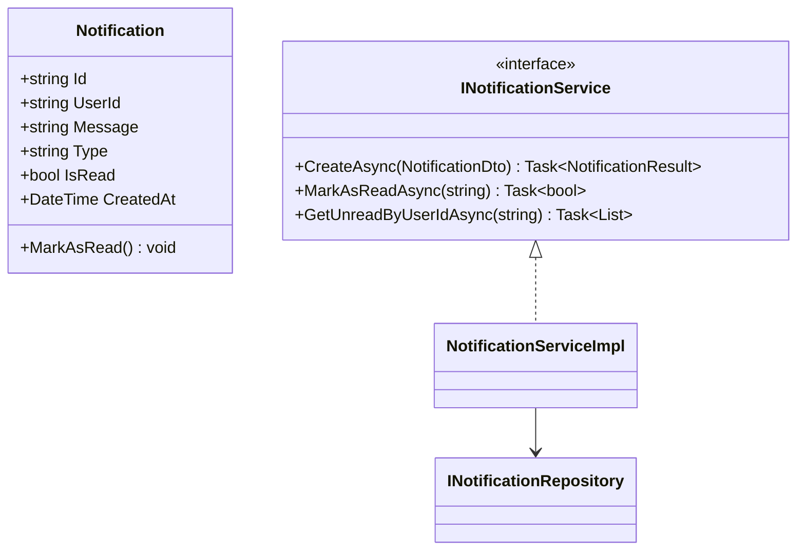
```mermaid
classDiagram
    class Notification {
        +string Id
        +string UserId
        +string Message
        +string Type
        +bool IsRead
        +DateTime CreatedAt
        +MarkAsRead() void
    }

    class INotificationService {
        <<interface>>
        +CreateAsync(NotificationDto) Task~NotificationResult~
        +MarkAsReadAsync(string) Task~bool~
        +GetUnreadByUserIdAsync(string) Task~List~
    }

    INotificationService <|.. NotificationServiceImpl
    NotificationServiceImpl --> INotificationRepository
```

---

## 5. Sequence Diyagramları

### 5.1 Başarılı API İsteği Akışı

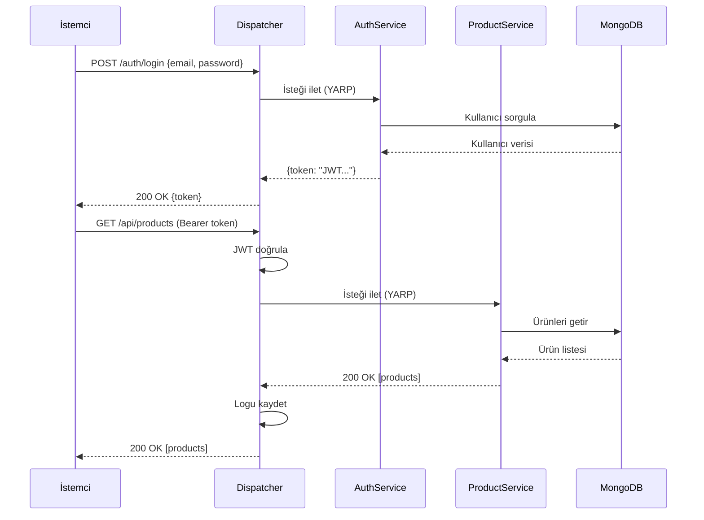
```mermaid
sequenceDiagram
    participant C as İstemci
    participant D as Dispatcher
    participant A as AuthService
    participant P as ProductService
    participant DB as MongoDB

    C->>D: POST /auth/login {email, password}
    D->>A: İsteği ilet (YARP)
    A->>DB: Kullanıcı sorgula
    DB-->>A: Kullanıcı verisi
    A-->>D: {token: "JWT..."}
    D-->>C: 200 OK {token}

    C->>D: GET /api/products (Bearer token)
    D->>D: JWT doğrula
    D->>P: İsteği ilet (YARP)
    P->>DB: Ürünleri getir
    DB-->>P: Ürün listesi
    P-->>D: 200 OK [products]
    D->>D: Logu kaydet
    D-->>C: 200 OK [products]
```

### 5.2 Yetkisiz İstek Akışı

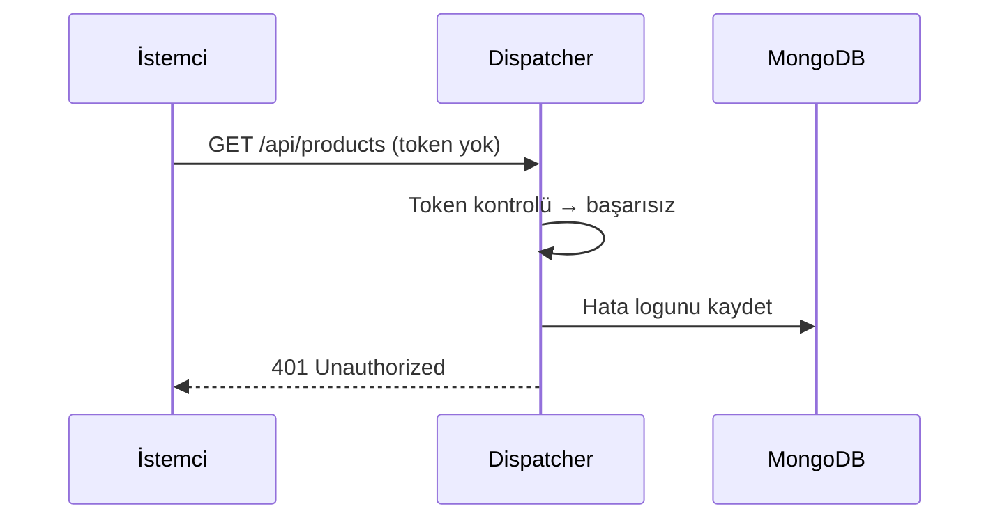
```mermaid
sequenceDiagram
    participant C as İstemci
    participant D as Dispatcher
    participant DB as MongoDB

    C->>D: GET /api/products (token yok)
    D->>D: Token kontrolü → başarısız
    D->>DB: Hata logunu kaydet
    D-->>C: 401 Unauthorized
```

### 5.3 Sipariş Oluşturma Akışı

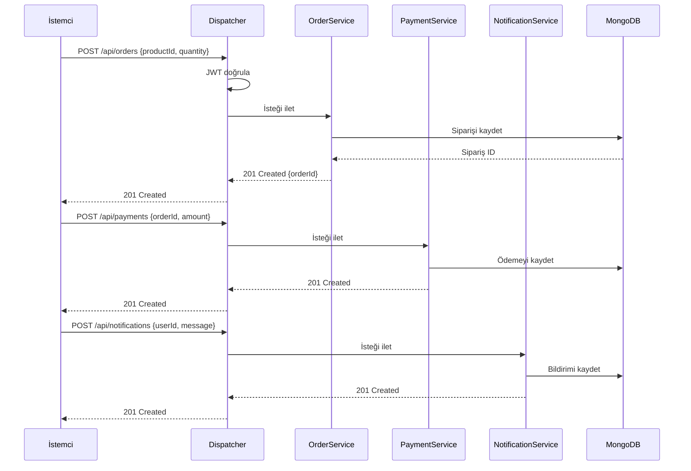
```mermaid
sequenceDiagram
    participant C as İstemci
    participant D as Dispatcher
    participant O as OrderService
    participant P as PaymentService
    participant N as NotificationService
    participant DB as MongoDB

    C->>D: POST /api/orders {productId, quantity}
    D->>D: JWT doğrula
    D->>O: İsteği ilet
    O->>DB: Siparişi kaydet
    DB-->>O: Sipariş ID
    O-->>D: 201 Created {orderId}
    D-->>C: 201 Created

    C->>D: POST /api/payments {orderId, amount}
    D->>P: İsteği ilet
    P->>DB: Ödemeyi kaydet
    P-->>D: 201 Created
    D-->>C: 201 Created

    C->>D: POST /api/notifications {userId, message}
    D->>N: İsteği ilet
    N->>DB: Bildirimi kaydet
    N-->>D: 201 Created
    D-->>C: 201 Created
```

---

## 6. TDD Yaklaşımı

Dispatcher bileşeni **Red-Green-Refactor** döngüsüyle geliştirilmiştir. Test dosyalarının git zaman damgası, uygulama kodlarından önce gelir.

### Test Dosyaları

| Test Dosyası | Test Edilen Bileşen |
|---|---|
| `ForwardingTests.cs` | `IRequestForwarder` |
| `RoutingTests.cs` | `IRouteRepository` |
| `LoggingTests.cs` | `ILogRepository` |
| `LogEntryTests.cs` | `LogEntry` domain modeli |
| `RouteConfigTests.cs` | `RouteConfig` domain modeli |

### TDD Döngüsü Örneği

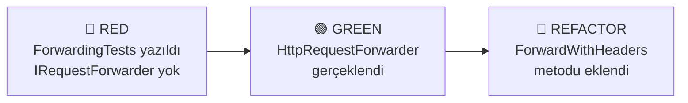
```mermaid
flowchart LR
    R["🔴 RED\nForwardingTests yazıldı\nIRequestForwarder yok"] -->
    G["🟢 GREEN\nHttpRequestForwarder\ngerçeklendi"] -->
    RF["🔵 REFACTOR\nForwardWithHeaders\nmetodu eklendi"]
```

Tüm servisler için de birim testleri yazılmıştır:

| Servis | Test Dosyaları |
|--------|---------------|
| AuthService | `UserTests`, `AuthServiceTests`, `UserRepositoryTests` |
| ProductService | `ProductTests`, `ProductServiceTests`, `ProductRepositoryTests` |
| OrderService | `OrderTests`, `OrderServiceTests`, `OrderRepositoryTests` |
| PaymentService | `PaymentTests`, `PaymentServiceTests`, `PaymentRepositoryTests` |
| NotificationService | `NotificationTests`, `NotificationServiceTests`, `NotificationRepositoryTests` |

---

## 7. Docker ve Sistem Orkestrasyonu

Tüm sistem tek komutla ayağa kalkar:

```bash
docker compose up -d
```

### Servis Listesi

| Servis | Port | Ağ |
|--------|------|----|
| dispatcher | 5100 | internal + external |
| auth-service | - | internal |
| product-service | - | internal |
| order-service | - | internal |
| payment-service | - | internal |
| notification-service | - | internal |
| mongodb | 27017 | internal |
| prometheus | 9090 | internal + external |
| grafana | 3000 | internal + external |

### İlk Kurulum

```bash
# 1. Sistemi başlat
docker compose up -d

# 2. Seed verilerini yükle (bir kez)
./seed.sh

# 3. Yük testini çalıştır
K6_PROMETHEUS_RW_SERVER_URL=http://localhost:9090/api/v1/write \
k6 run --out experimental-prometheus-rw load-test.js
```

---

## 8. Görselleştirme

### 8.1 Grafana Dashboard

`http://localhost:3000` → Dashboards → Microservices → **YAZLAB-V2 Mikroservis Genel Bakış**

Dashboard aşağıdaki bölümleri içermektedir:

| Bölüm | İçerik |
|-------|--------|
| **Genel Metrikler** | Toplam istek, hata oranı, P95 latency, aktif istek, auth hataları |
| **İstek Trafiği** | Servise göre yönlendirme hızı, istek dağılımı (donut grafik) |
| **Yanıt Süresi** | P50/P90/P95/P99 latency grafikleri |
| **Hata Analizi** | 4xx/5xx hata oranları, auth failure rate |
| **Yük Testi (k6)** | VU sayısı, istek süresi, hata oranı |
| **İş Metrikleri** | Sipariş, ödeme, bildirim, ürün sayaçları |
| **Servis Durumu** | Tüm servislerin UP/DOWN durumu |

### 8.2 Log Tablosu

`http://localhost:5100/admin/logs` adresinde tüm trafik logları görüntülenir:

- HTTP metodu, path, durum kodu
- Yanıt süresi (ms) — renkli gösterim
- İstemci IP adresi
- Zaman damgası

---

## 9. Yük Testi

k6 ile 5 aşamalı yük testi uygulanmıştır:

| Aşama | Süre | Eşzamanlı Kullanıcı |
|-------|------|---------------------|
| Ramping up | 30s | 0 → 50 |
| Yük artışı | 30s | 50 → 100 |
| Yoğun yük | 30s | 100 → 200 |
| Pik yük | 30s | 200 → 500 |
| Ramping down | 30s | 500 → 0 |

### Test Sonuçları

| Metrik | Değer |
|--------|-------|
| Toplam istek | 20.411 |
| Hata oranı | **%0.00** |
| Checks başarı | **%100** |
| Ortalama yanıt | 1.02s |
| P90 yanıt | 4.15s |
| P95 yanıt | 6.89s |
| Maks VU | 500 |

Test senaryosu şunları kapsar:
- Her VU farklı bir kullanıcıyla login olur
- Ürünleri listeler
- Rastgele ürün ile sipariş oluşturur
- Sipariş ID'si ile ödeme başlatır
- Bildirim oluşturur

---

## 10. Ekran Görüntüleri

### Docker Container Durumu
`docker ps` çıktısı — tüm servisler UP

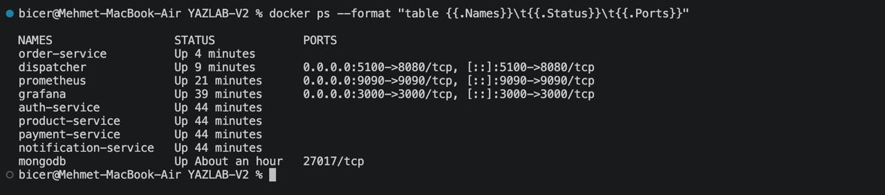

### Swagger API Dokümantasyonu
`localhost:5100/swagger` — Dispatcher endpoint'leri

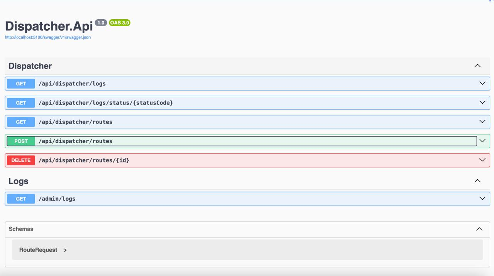

### JWT Yetkilendirme
`localhost:5100/api/products` tokensiz → **401 Unauthorized**

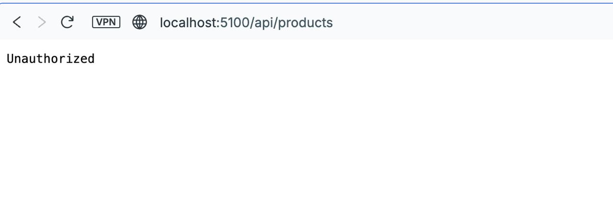

### Log Tablosu
`localhost:5100/admin/logs` — ResponseTimeMs ve ClientIp dahil

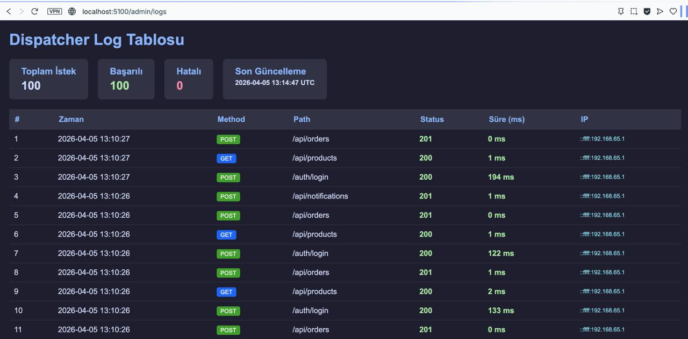

### Prometheus Targets
`localhost:9090/targets` — 6 servis UP

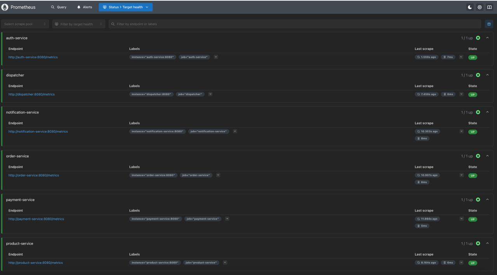

### k6 Yük Testi Sonuçları
Terminal çıktısı — %100 başarı, %0 hata

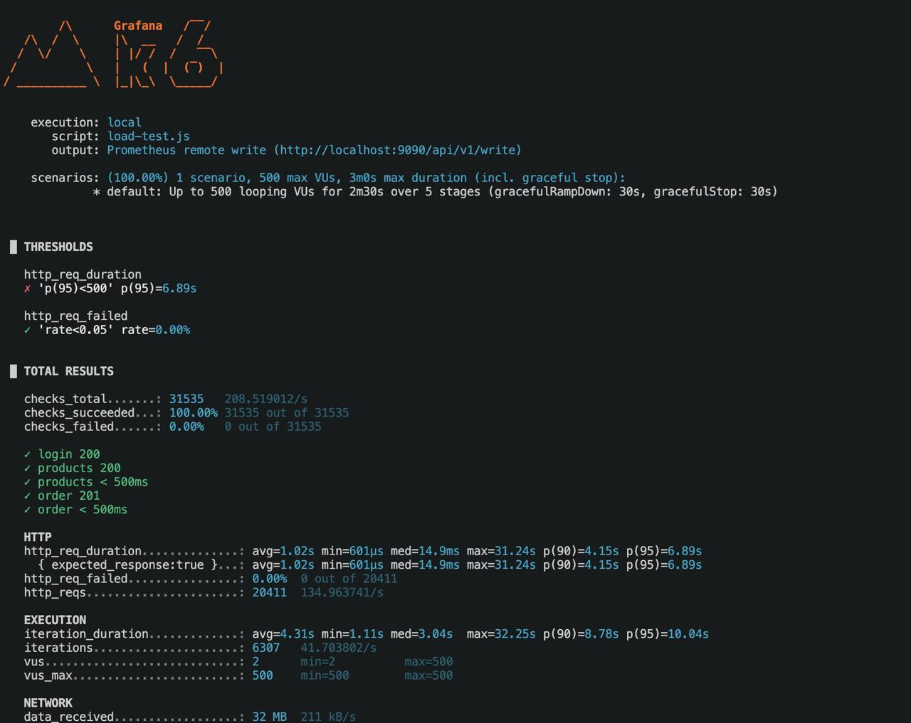

### Grafana Genel Bakış
`localhost:3000` — 20.4K istek, %0 hata, servis dağılımı

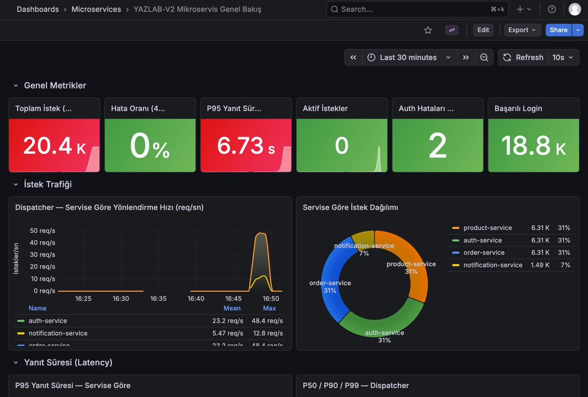

### Grafana k6 Panelleri
500 VU ramping, istek hızı ve HTTP metot dağılımı

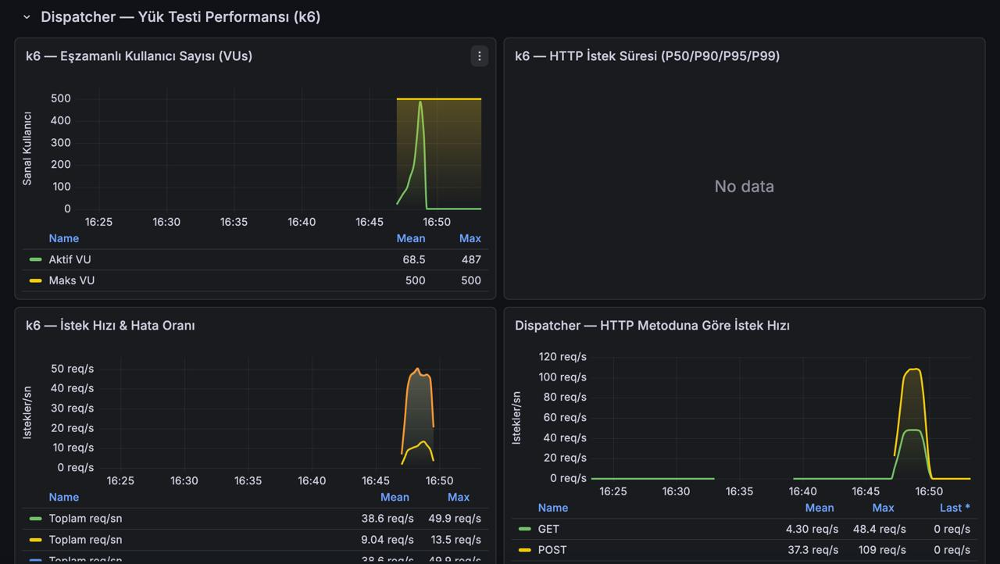

### Grafana İş Metrikleri
Sipariş, ödeme, bildirim ve ürün sayaçları

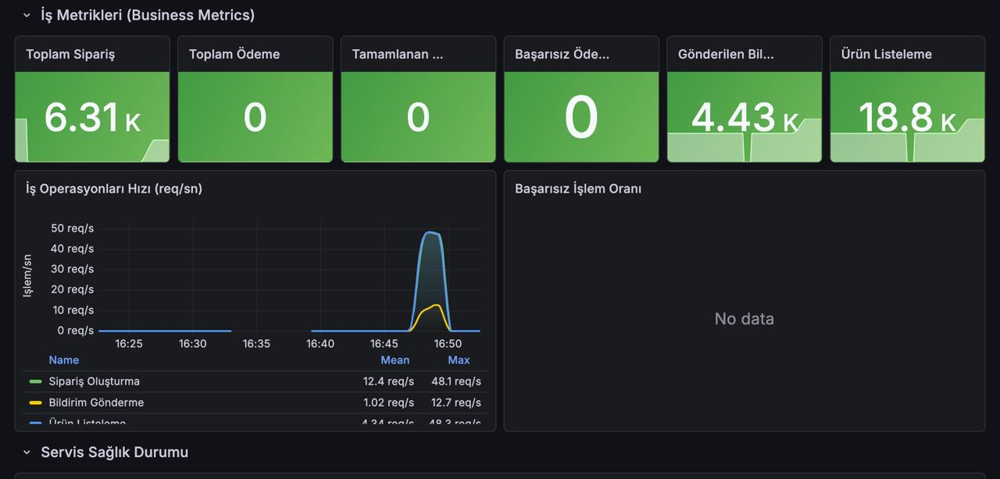

### Network Isolation Kanıtı
`curl localhost:8080/api/products` → **Connection refused**

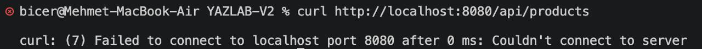

---

## 11. Sonuç ve Tartışma

### Başarılar

- Tüm mikroservisler bağımsız olarak geliştirildi ve Docker ile izole edildi
- Dispatcher merkezi yetkilendirme ve yönlendirme görevini başarıyla üstlendi
- TDD disiplini Dispatcher için eksiksiz uygulandı; test dosyaları implementasyondan önce yazıldı
- Prometheus + Grafana ile gerçek zamanlı izleme sağlandı
- 500 eşzamanlı kullanıcıyla yapılan yük testinde **%0 hata oranı** elde edildi
- Network isolation ile mikroservislere doğrudan dış erişim engellendi

### Sınırlılıklar

- 500 eşzamanlı kullanıcıda P95 yanıt süresi 6.89s'e çıkmaktadır; bu durum local makinenin kaynak kısıtından kaynaklanmaktadır
- Servisler arası iletişim şu an Dispatcher üzerinden sağlanmakta, servisler birbirini doğrudan çağırmamaktadır
- JWT key environment variable yerine kod içinde tanımlıdır

### Olası Geliştirmeler

- **RMM Seviye 3 (HATEOAS)**: Response'lara link ekleyerek API keşfedilebilirliği artırılabilir
- **Rate Limiting**: Dispatcher'a istek sınırlama eklenebilir
- **Circuit Breaker**: Servis kesintilerinde otomatik devre kesici mekanizması eklenebilir
- **Message Queue**: Servisler arası asenkron iletişim için RabbitMQ/Kafka entegrasyonu yapılabilir
- **JWT Key yönetimi**: Secret key environment variable veya secret manager ile yönetilmelidir
